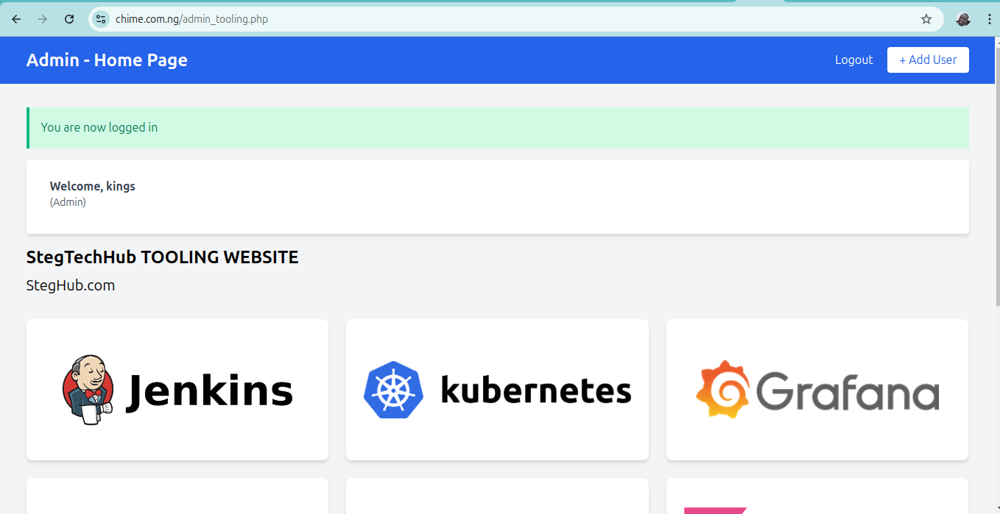
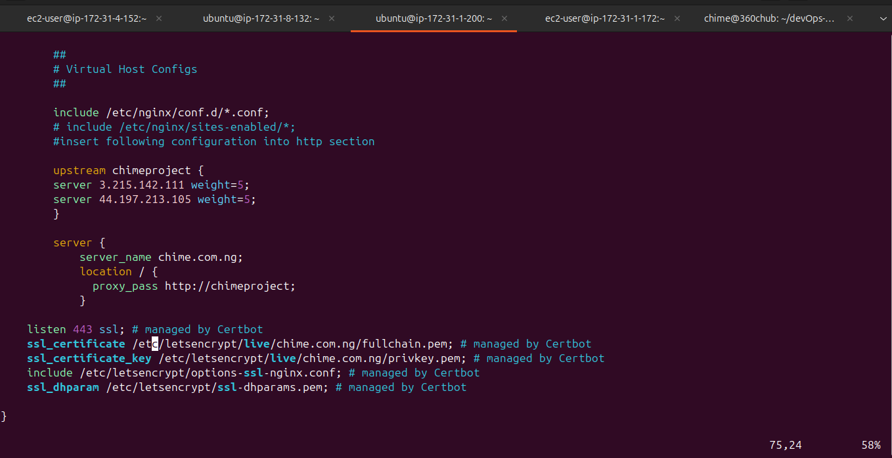
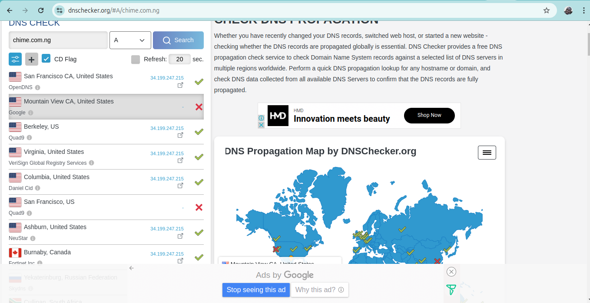
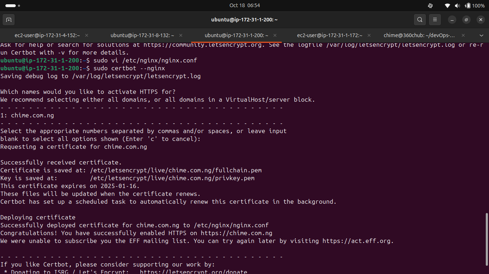

# Learnings.md: Nginx Load Balancing with HTTPS using Certbot

## Table of Contents
1. [Project Overview](#project-overview)
2. [Self Study](#self-study)
   - [Understanding Cyber Attacks](#understanding-cyber-attacks)
   - [Mitigating Cyber Attacks](#mitigating-cyber-attacks)
   - [Key Concepts](#key-concepts)
3. [Project Steps](#project-steps)
4. [Conclusion and Key Learnings](#conclusion-and-key-learnings)

---

## Project Overview
In this project, I successfully set up load balancing using Nginx and configured HTTPS with Certbot for secure communications. The process involved multiple EC2 instances, extensive configuration, and understanding of key networking concepts.



---

## Self Study

### Understanding Cyber Attacks
1. **Man-in-the-Middle (MITM) Attack**: An attacker intercepts communication between two parties, allowing them to eavesdrop or alter messages without either party knowing.
2. **Network Eavesdropping**: A simpler form of MITM, where the attacker uses tools (like Wireshark or tcpdump) to capture and analyze data packets transmitted over the network.
3. **SSL Stripping**: An advanced attack that downgrades secure HTTPS connections to HTTP, allowing attackers to intercept sensitive information.

### Mitigating Cyber Attacks
1. **SSL/TLS**: Cryptographic protocols providing secure communication. SSL/TLS encrypts data to ensure confidentiality, using digital certificates for server authentication.
2. **Use HTTPS**: Ensures that all communications between the client and server are encrypted, protecting against eavesdropping.

### Key Concepts
- **DNS Record Types**: Briefly, DNS records are used to map domain names to IP addresses and can include various types like A, AAAA, CNAME, and MX records.
- **Cron Jobs**: Scheduled tasks that automate processes on the server, such as renewing SSL certificates.

---

## Project Steps

1. **EC2 Instances Setup**: Launched four EC2 instances—two configured as web servers, one as a database server, and one as a load balancer, ensuring proper security group configurations.

2. **Nginx Installation on Load Balancer**:
   ```bash
   sudo apt update
   sudo apt install nginx
   ```

3. **Nginx Configuration as Load Balancer**:
   - Configured Nginx to distribute traffic between the web servers.
   

4. **Load Balancer Testing**: Verified that the load balancer was distributing traffic correctly.

5. **Elastic IP Association**: Associated an Elastic IP address with the Nginx load balancer for consistent IP mapping.

6. **Domain DNS Update**: Updated my domain's DNS settings to point to the Elastic IP of the load balancer.
   

7. **Certbot Installation and HTTPS Configuration**:
   - Installed Certbot to manage SSL certificates.
   ```bash
   sudo apt install certbot python3-certbot-nginx
   ```
   - Configured Certbot to work with Nginx for HTTPS on `chime.com.ng`.
   

8. **Cron Job Setup for Certificate Renewal**:
   - Added a cron job to renew the SSL certificate automatically.
   ```bash
   sudo crontab -e
   # Add the following line for monthly renewal
   0 0 1 * * /usr/bin/certbot renew
   ```

---

## Conclusion and Key Learnings

1. **Technical Proficiencies**: Gained expertise in configuring NFS servers, web servers, load balancers, database servers, DNS settings, SSL/TLS encryption, and cron jobs.
   
2. **Nginx Mastery**: Enhanced my understanding of Nginx load balancing, reverse proxy setups, SSL/TLS configurations, virtual hosts, server blocks, location blocks, proxy pass, and upstream configurations.

3. **Security Awareness**: Developed a deeper awareness of cybersecurity threats and the importance of implementing robust security measures like SSL/TLS.

By documenting this process, I have solidified my understanding of deploying and securing web applications in a cloud environment, ensuring that they are resilient, efficient, and secure.

--- 

## Additional Steps for improvement
1. **Monitoring and Logging**: Implement monitoring tools like CloudWatch or ELK Stack to track server performance and log data.
2. **Automated Deployment**: Use tools like Jenkins, Ansible or Terraform for automated deployment and configuration management.
3. **Scaling**: Explore auto-scaling groups to automatically adjust the number of EC2 instances based on traffic load.
4. **Backup and Disaster Recovery**: Set up regular backups and disaster recovery plans to ensure data safety and business continuity.


### Author
- **Chime Kingsley:** onlinekingsley@gmail.com