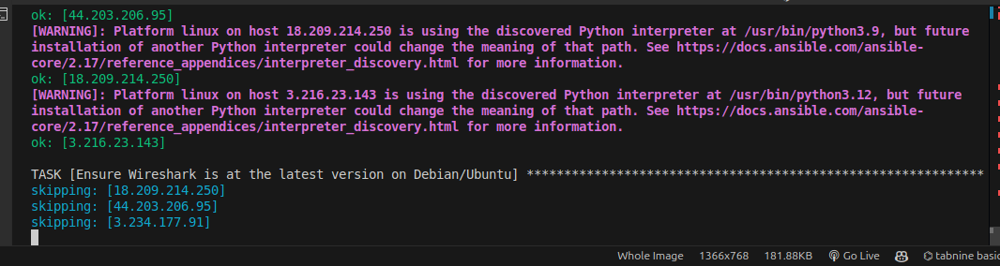

# Learnings.md: Ansible Configuration Management for Multi-Tier Architecture

## Table of Contents
1. [Project Overview](#project-overview)
2. [Self Study](#self-study)
   - [Jump Server](#jump-server)
   - [Bastion Host](#bastion-host)
   - [SSH Agent](#ssh-agent)
   - [Key Ansible Commands](#key-ansible-commands)
   - [Key Takeaways from Self Study](#key-takeaways-from-self-study)
3. [Project Steps](#project-steps)
4. [Conclusion and Key Learnings](#conclusion-and-key-learnings)


---

## Project Overview
In this project, I configured Ansible to automate management tasks across a multi-tier infrastructure consisting of:
- **Two Web Servers (RedHat EC2)** connected to an NFS server.
- **One NFS Server** for shared storage.
- **One Database Server**.
- **One Load Balancer** linked to `chime.com.ng` and directing traffic to web servers.
- **Jenkins Server** for CI/CD automation.

By utilizing Ansible playbooks, I automated software updates, package installations, timezone configurations, and custom file creation on each server. This setup improved operational efficiency, consistency, and minimized manual configuration errors.


---

## Self Study

### Jump Server
A **jump server** is a dedicated machine on a network that provides a secure access point for remote administration of servers located in a private network. Jump servers enhance security by controlling and monitoring access to critical infrastructure, often placed in a DMZ or highly secure network segment.

### Bastion Host
Similar to a jump server, a **bastion host** acts as a gateway between trusted and untrusted networks. It enables secure administrative access to private network instances, providing logging and security checks to mitigate unauthorized access. Bastion hosts typically have a strict set of security policies and serve as a point of entry for SSH connections to the internal network.

### SSH Agent
An **SSH agent** is a tool that manages SSH keys in memory, allowing for secure connections to remote servers without repeatedly entering the passphrase. By storing and handling SSH keys in memory, it simplifies authentication in automated deployments and scripts. SSH agents are particularly useful in Ansible, where multiple servers may be accessed during a single playbook execution.

### Key Ansible Commands
1. **ansible all -m ping**: Tests connectivity to all hosts in the inventory by sending a ping.
2. **ansible-playbook playbook.yml -i inventory.ini**: Runs the specified playbook using the given inventory file.
3. **ansible-vault encrypt file.yml**: Encrypts sensitive data in files with Ansible Vault, enhancing security for passwords and sensitive configurations.

### Key Takeaways from Self Study
- Use **jump servers and bastion hosts** for controlled, secure access to private networks.
- **SSH agents** streamline SSH authentication, essential for efficient Ansible automation.
- Familiarity with **core Ansible commands** is crucial for managing infrastructure effectively.

---

## Project Steps

1. **Inventory Setup**: Configured an inventory file with the IPs and roles of each server, divided into groups such as `webservers`, `nfs`, `dbserver`, and `lb`.

2. **Playbook Creation**:
   - Developed playbooks to perform tasks like installing and updating software, setting time zones, and creating directories and files.
   

3. **Playbook Execution**:
   - Used the following command to execute the primary playbook:
     ```bash
     ansible-playbook playbooks/common.yml -i inventory/dev.yml
     ```
   

4. **Automated Timezone Configuration**: Configured all servers to use the ‘Africa/Lagos’ timezone to maintain consistency across deployments.

5. **File Management**:
   - Created directories and populated files on each server, ensuring standardized content delivery.

6. **Software Installation and Update**:
   - Installed essential packages (e.g., Wireshark) across the RedHat and Ubuntu servers, using `yum` or `apt` based on each server's OS.

---

### Automated CI with Jenkins
- Like the previous project, I've setup a github repo named `ansible-confit-mgt` that triggers a jenkins job for continuous integration

## Conclusion and Key Learnings

1. **Efficient Server Management**: Gained proficiency in managing a multi-tier architecture using Ansible, including web servers, load balancers, NFS, and database servers.
2. **Ansible’s Versatility**: Learned the versatility of Ansible's modules (`yum`, `apt`, `file`, etc.) to handle diverse configuration requirements across different OS families.
3. **Security and Best Practices**: Developed a solid understanding of secure access methods, like jump servers and SSH agents, for managing cloud infrastructure.

---

### Images from the Project
Below are images showcasing essential steps and configurations from the project:

--- 

## Additional Steps for Improvement
1. **Centralized Logging**: Set up a centralized logging system to monitor server and application logs in real time.
2. **Enhanced Security Policies**: Implement further security policies, such as IP whitelisting and MFA, on the bastion host.
3. **Automated Backup**: Use Ansible to automate regular backups of server configurations and data to S3 for disaster recovery. 

---

### Author
- **Chime Kingsley:** onlinekingsley@gmail.com