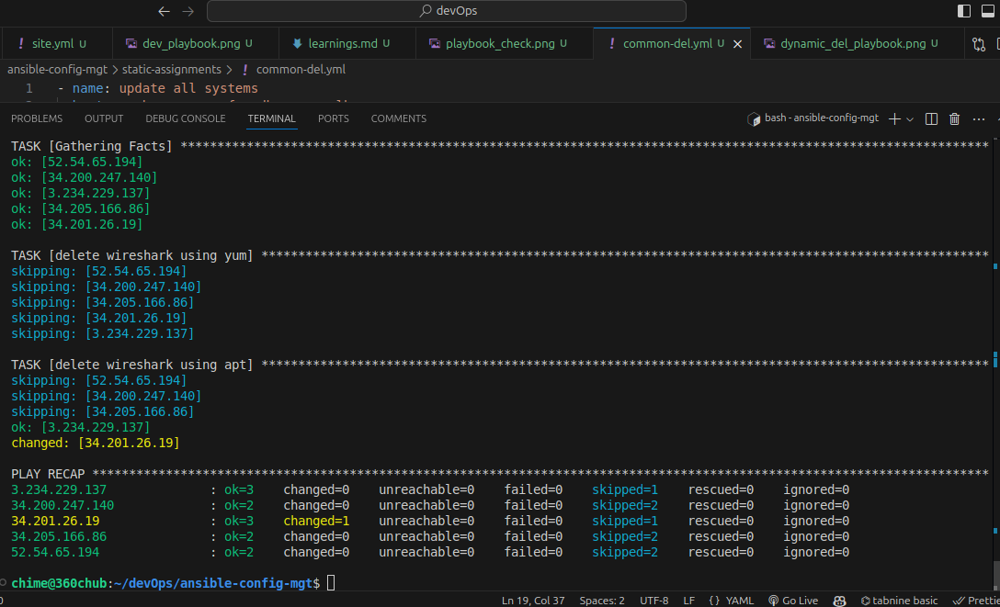
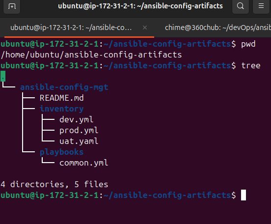
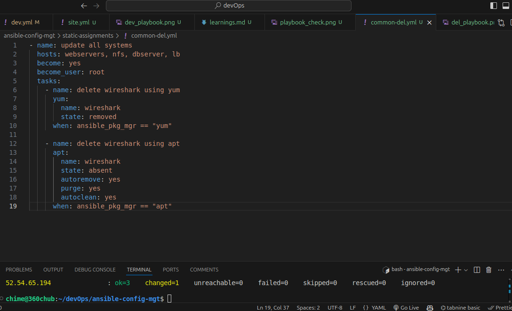
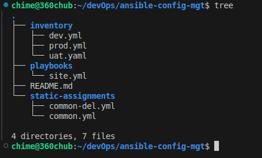
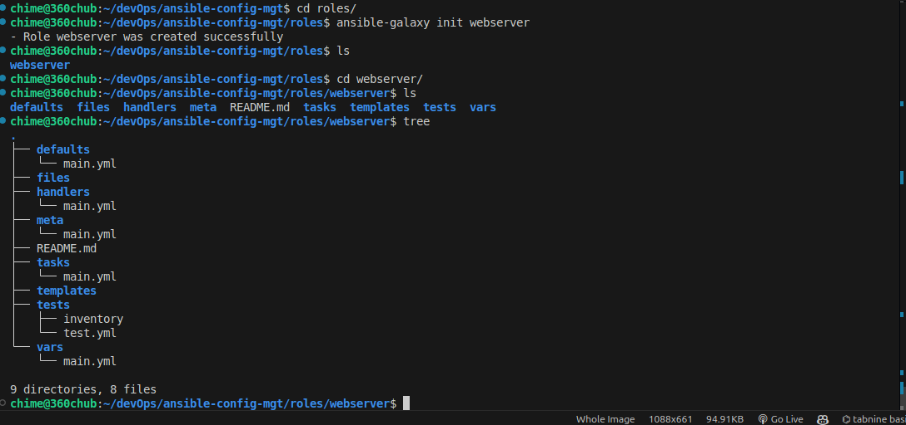
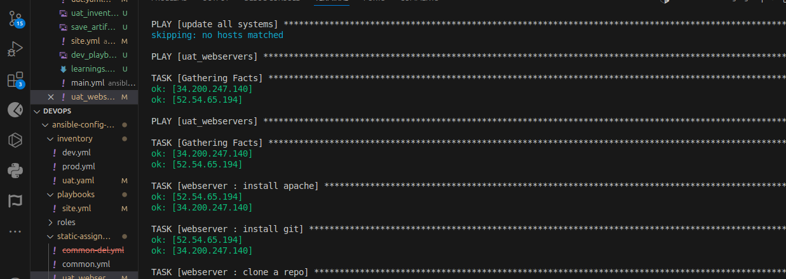
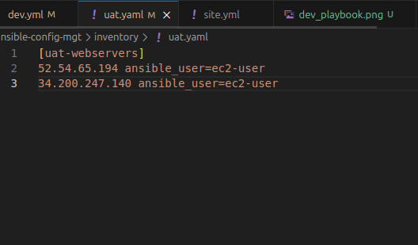
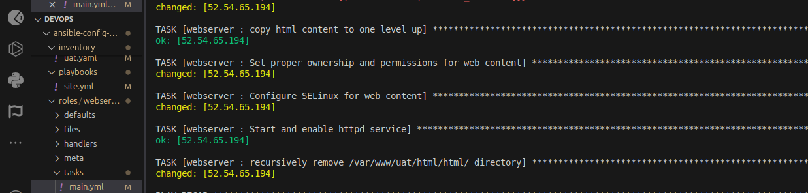
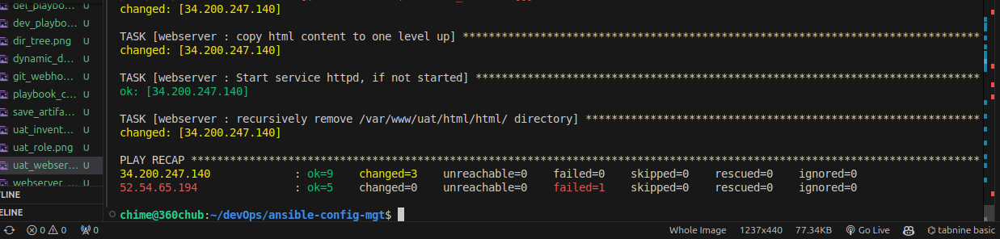

# Ansible Refactoring, Static Assignments, and Imports

## Table of Contents
1. [Self Study](#self-study)
   - [Ansible Artifacts](#ansible-artifacts)
   - [Ansible Imports](#ansible-imports)
2. [Project Work](#project-work)
   - [Setting Up the Artifacts Directory in Jenkins](#setting-up-the-artifacts-directory-in-jenkins)
   - [Automating with GitHub Webhook and Jenkins](#automating-with-github-webhook-and-jenkins)
   - [Creating Static Assignments and Imports](#creating-static-assignments-and-imports)
   - [Role Setup and Configuration](#role-setup-and-configuration)
   - [Testing and Validation](#testing-and-validation)

---

## Self Study

### Ansible Artifacts
Ansible offers four main types of reusable, distributed artifacts:

1. **Variable Files**: These files contain variables that can be used across playbooks.
2. **Task Files**: Task files contain only tasks, which can be called or included in various playbooks.
3. **Playbook**: A YAML file containing plays, roles, and tasks that define the workflows Ansible executes.
4. **Role**: A structured directory of playbooks and files organized to facilitate modular reuse within playbooks.

By breaking down an Ansible playbook into smaller components (plays, roles, and tasks), it becomes more manageable, maintainable, and reusable across different projects.

### Ansible Imports
Imports allow task lists and other files to be included in the main playbook, making it easier to modularize the code. Imports can be categorized into:

- **Static Imports**: 
   - Imported at the beginning of the playbook using `import_playbook: playbook_name.yaml`.
   - Can also be dynamically loaded at runtime with `vars` like `import_playbook: "{{ playbook_name }}.yaml"`.

- **Dynamic Imports**: 
   - Used with `include_*` statements, such as `include_vars`, `include_tasks`, and `include_role`.
   - Evaluated at runtime and often used conditionally to include files based on specific requirements.

---

## Project Work

### Setting Up the Artifacts Directory in Jenkins
To manage reusable artifacts, a `save_artifacts` job was created in Jenkins, allowing files from the `ansible-config-mgt` repository to be copied into an `artifacts` directory within the home directory.

### Automating with GitHub Webhook and Jenkins
To enable continuous integration, a GitHub webhook was configured to trigger the Jenkins job automatically whenever there was a push to the `ansible-config-mgt` repository.

### Creating Static Assignments and Imports
A new directory was created to store static assignments and imported playbooks, streamlining the organization of tasks. This restructuring left the main playbook as a minimal entry point, with other playbooks and tasks imported from designated static folders.

An example task, `common-del.yml`, was created to handle the deletion of `wireshark` from all servers as a static assignment.

Conditional execution was also applied using the `when` statement, ensuring tasks ran only if the package manager on the server matched specified criteria.

### Role Setup and Configuration
An `ansible.cfg` file was configured to set the default roles path to the `roles/` directory. Using `ansible-galaxy init`, a new role named `webserver` was created within the `roles/` directory for modular, reusable configuration.

  

Two instances were launched for user acceptance testing (UAT), configured with the `webserver` role. A `uat_webserver.yml` playbook was developed to apply this role to the UAT instances.

An inventory file was created to define the UAT webserver instances, ensuring accurate targeting.

### Testing and Validation
Testing was conducted with `ansible-playbook --check` to verify changes without execution, followed by a full execution to apply configurations. The success of the UAT configuration was validated, and results were documented.

  

