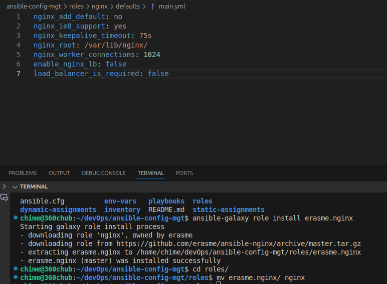
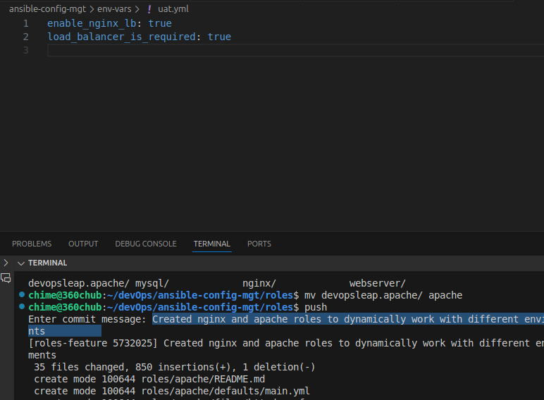

# Ansible Dynamic Assignments and Community Roles

## Table of Contents
1. [Self Study](#self-study)
   - [Ansible Dynamic Assignments](#ansible-dynamic-assignments)
   - [Ansible Imports and Includes](#ansible-imports-and-includes)
   - [Community Roles](#community-roles)
2. [Project Implementation](#project-implementation)
   - [Directory Structure](#directory-structure)
   - [Dynamic Assignments Setup](#dynamic-assignments-setup)
   - [Environment Variables Configuration](#environment-variables-configuration)
   - [Community Role Integration](#community-role-integration)
   - [Load Balancer Implementation](#load-balancer-implementation)

## Self Study

### Ansible Dynamic Assignments
Dynamic assignments in Ansible allow for flexible and conditional inclusion of variables and tasks at runtime. Key components include:

- Variable files that can be dynamically included based on environment
- Task files that can be conditionally loaded
- Environment-specific configurations
- Runtime evaluation of conditions and variables


### Ansible Imports and Includes
Ansible provides several methods for modularizing playbooks:

1. **Static Imports**:
   - `import_playbook`
   - `import_tasks`
   - `import_role`
   - Processed during playbook parsing

2. **Dynamic Includes**:
   - `include_vars`
   - `include_tasks`
   - `include_role`
   - Processed at runtime
   - Allows for conditional inclusion

### Community Roles
Ansible Galaxy provides a hub for community-developed roles that can be easily integrated into projects:

- Pre-built, production-ready roles
- Extensively tested across different Linux distributions
- Configurable through variables
- Regular updates and community support


## Project Implementation

### Directory Structure
The project follows a structured layout:


### Dynamic Assignments Setup
1. Created a new branch called `dynamic-assignments`
2. Implemented dynamic variable inclusion using `include_vars`
3. Configured environment-specific variable files
4. Updated `site.yml` to use dynamic assignments

```yaml
# env-vars.yml
---
- name: collate variables from env specific file, if it exists
  hosts: all
  tasks:
    - name: looping through list of available files
      include_vars: "{{ item }}"
      with_first_found:
        - files:
            - dev.yml
            - stage.yml
            - prod.yml
            - uat.yml
          paths:
            - "{{ playbook_dir }}/../env-vars"
      tags:
        - always
```

### Community Role Integration

#### MySQL Role
1. Installed the `geerlingguy.mysql` role using Ansible Galaxy
2. Configured MySQL credentials for the tooling website
3. Integrated the role into the playbook structure


#### Load Balancer Roles
Implemented conditional load balancer selection:

1. Created roles for both Nginx and Apache
2. Implemented variable-based role selection:
   ```yaml
   enable_nginx_lb: false
   enable_apache_lb: false
   load_balancer_is_required: false
   ```



3. Updated playbooks to use conditions:
   ```yaml
   # loadbalancers.yml
   - hosts: lb
     roles:
       - { role: nginx, when: enable_nginx_lb and load_balancer_is_required }
       - { role: apache, when: enable_apache_lb and load_balancer_is_required }
   ```



### Environment Variables Configuration
1. Created environment-specific variable files
2. Implemented variable precedence using `with_first_found`
3. Set up conditional role execution based on environment variables

### Project Testing and Validation
1. Tested dynamic assignments across different environments
2. Validated load balancer role switching
3. Confirmed proper MySQL role configuration
4. Verified environment-specific variable loading

## Key Learnings
1. Understanding the difference between static imports and dynamic includes
2. Leveraging community roles for production-ready implementations
3. Implementing environment-specific configurations
4. Managing role dependencies and conditions
5. Structuring Ansible projects for scalability

## Next Steps
- Explore more complex role interactions
- Implement additional community roles
- Enhance environment-specific configurations
- Add more sophisticated condition handling
- Integrate with CI/CD pipelines