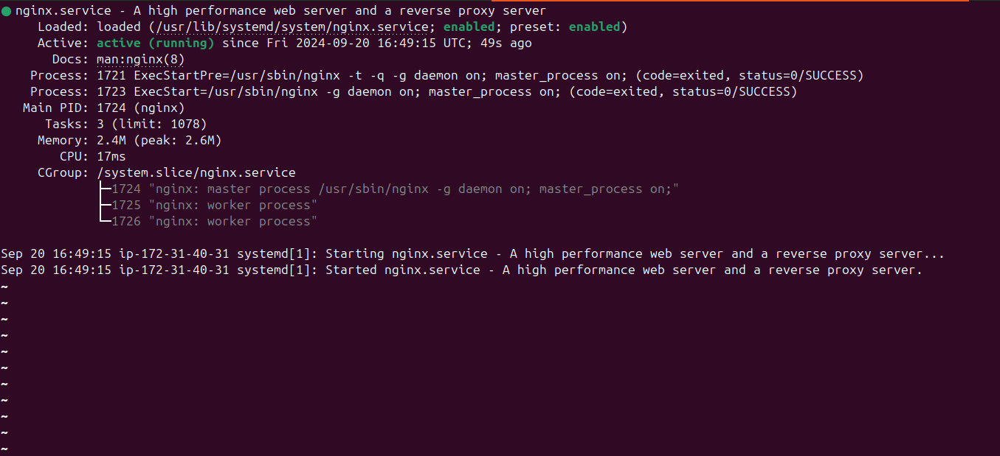
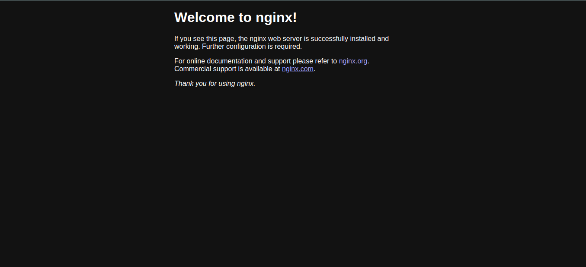
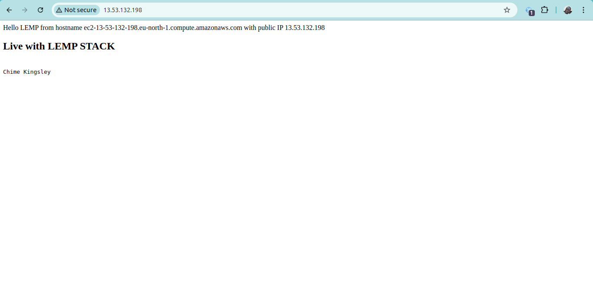
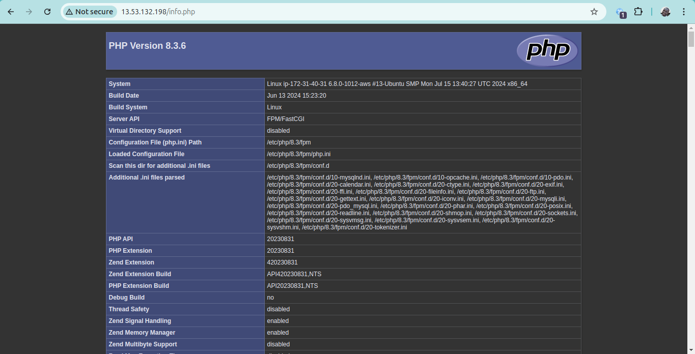
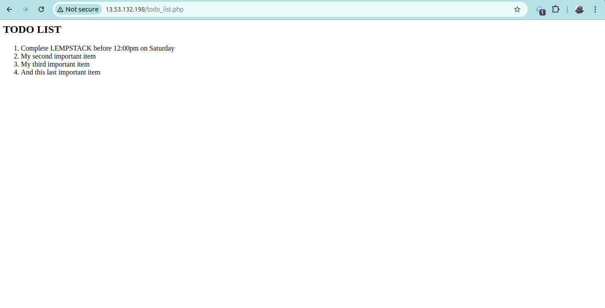

# LEMP Stack Deployment on AWS EC2
## Table of Contents

1. [Introduction](#introduction)
2. [Skills Acquired](#skills-acquired)
3. [Learning Objectives](#learning-objectives)
4. [Project Steps](#project-steps)
   1. [Environment Setup](#1-environment-setup)
   2. [Installing Nginx and Updating Firewall](#2-installing-nginx-and-updating-firewall)
   3. [Installing MySQL](#3-installing-mysql)
   4. [Installing PHP](#4-installing-php)
   5. [Configuring Nginx Server Blocks](#5-configuring-nginx-server-blocks)
   6. [Testing PHP with Nginx](#6-testing-php-with-nginx)
   7. [Creating MySQL Database and User](#7-creating-mysql-database-and-user)
   8. [Creating PHP Script to Retrieve Data from Database](#8-creating-php-script-to-retrieve-data-from-database)
5. [LEMP Stack Components](#lemp-stack-components)
6. [Conclusion](#conclusion)
7. [Future Enhancements](#future-enhancements)
8. [Contributing](#contributing)

## Introduction

This DevOps project demonstrates the successful deployment of a **LEMP** stack (Linux, Nginx, MySQL, PHP) on an AWS EC2 instance. The project utilizes Ubuntu 24 as the base operating system, Nginx as the web server, MySQL as the database management system, and PHP as the server-side scripting language. Additionally, it includes the configuration of Nginx server blocks to enable hosting multiple websites on the same server.

## Skills Acquired

- Scripting
- Foundations of DevOps
- Cloud Infrastructure Management
- Web Server Configuration
- Database Setup and Security

## Learning Objectives

- [x] Set up the AWS Console for cloud resource management
- [x] Launch an EC2 instance on AWS and connect via SSH
- [x] Understand web server technology stacks
- [x] Install Nginx, MySQL, and PHP on an EC2 instance
- [x] Configure Nginx to use Server Blocks for multiple websites

## Project Steps

### 1. Environment Setup

- Configured development environment in Visual Studio Code
- Created an AWS account and set up the AWS Management Console
- Launched an EC2 instance and connected via SSH 
- Configured EC2 instance security group rules to allow access to select ports (22 and 80)

### 2. Installing Nginx and Updating Firewall

Installed Nginx web server and verified successful installation.

```bash
sudo apt update
sudo apt install nginx
sudo service nginx status
```

Verified that Nginx is serving locally:
```bash
curl localhost
```
Verified that Nginx is publicly accessible:
```bash
TOKEN=$(curl -X PUT "http://169.254.169.254/latest/api/token" -H "X-aws-ec2-metadata-token-ttl-seconds: 21600")
curl -H "X-aws-ec2-metadata-token: $TOKEN" http://169.254.169.254/latest/meta-data/public-ipv4
```


### 3. Installing MySQL

Installed MySQL and secured the installation:

```bash
sudo apt install mysql-server
sudo mysql_secure_installation
```

### 4. Installing PHP

Installed PHP and necessary modules:

```bash
sudo apt install php-fpm php-mysql -y
```

### 5. Configuring Nginx Server Blocks

Created a new Server Block for `chime.com`:

```bash
sudo mkdir /var/www/chime.com
sudo chown -R $USER: /var/www/chime.com
sudo vim /etc/nginx/sites-available/chime.com
```

Server Block configuration:

```nginx
#/etc/nginx/sites-available/chime.com

server {
    listen 80;
    server_name  13.53.132.198 chime.com www.chime.com;
    root /var/www/chime.com;

    index index.html index.htm index.php;

    location / {
        try_files $uri $uri/ =404;
    }

    location ~ \.php$ {
        include snippets/fastcgi-php.conf;
        fastcgi_pass unix:/var/run/php/php8.3-fpm.sock;
     }

    location ~ /\.ht {
        deny all;
    }
}
```


### 6. Testing PHP with Nginx

Created a PHP info page:

```bash
sudo echo '<?php phpinfo(); ?>' > /var/www/chime.com/info.php
```


### 7. Creating MySQL Database and User
```sql
-- Create the database
CREATE DATABASE chime_db;

-- Create the user with appropriate privileges
CREATE USER 'kings'@'%' IDENTIFIED WITH mysql_native_password BY 'Some super strong password';
GRANT ALL PRIVILEGES ON chime_db.* TO 'kings'@'%';

-- Create the todo_list table
CREATE TABLE chime_db.todo_list (
    item_id INT AUTO_INCREMENT PRIMARY KEY,
    content VARCHAR(255)
);

-- Insert data into the table
INSERT INTO chime_db.todo_list (content) VALUES ("Complete LEMPSTACK before 12:00pm on Saturday");
INSERT INTO chime_db.todo_list (content) VALUES ("My second important item");
INSERT INTO chime_db.todo_list (content) VALUES ("My third important item");
INSERT INTO chime_db.todo_list (content) VALUES ("And this last important item");

-- Select all data from the table
SELECT * FROM chime_db.todo_list;
```

### 8. Creating PHP Script to Retrieve Data from Database
```bash
sudo vi /var/www/chime.com/todo_list.php
```
```php
<?php
$user = "kings";
$password = "some super strong password";
$database = "chime_db";
$table = "todo_list";

try {
  $db = new PDO("mysql:host=localhost;dbname=$database", $user, $password);
  echo "<h2>MY TODO LIST</h2><ol>";
  foreach($db->query("SELECT content FROM $table") as $row) {
    echo "<li>". $row['content'] . "</li>";
  }
  echo "</ol>";
} catch (PDOException $e) {
    print "Error!: " . $e->getMessage() . "<br/>";
    die();
}
```



## LEMP Stack Components

| Component | Description | Status |
|-----------|-------------|--------|
| Linux     | Ubuntu 24 on AWS EC2 | ✅ |
| Nginx     | Web Server | ✅ |
| MySQL     | Database Management System | ✅ |
| PHP       | Server-side Scripting | ✅ |

## Conclusion

This project successfully deployed a fully functional LEMP stack on an AWS EC2 instance. Key accomplishments include:

- Setting up a cloud environment on AWS
- Installing and configuring Linux, Nginx, MySQL, and PHP
- Configuring Nginx Server Blocks for multiple websites

The hands-on experience gained from this project reinforces understanding of cloud computing, server administration, and DevOps fundamentals. The skills acquired in scripting, system administration, and cloud infrastructure management are crucial for the DevOps field and provide a solid foundation for more advanced projects and deployments.

## Future Enhancements

- Implement SSL/TLS for secure connections
- Set up a CI/CD pipeline for automated deployments
- Explore containerization of the LEMP stack using Docker

## Contributing

Contributions to improve this project are welcome. Please fork the repository and submit a pull request with your changes.