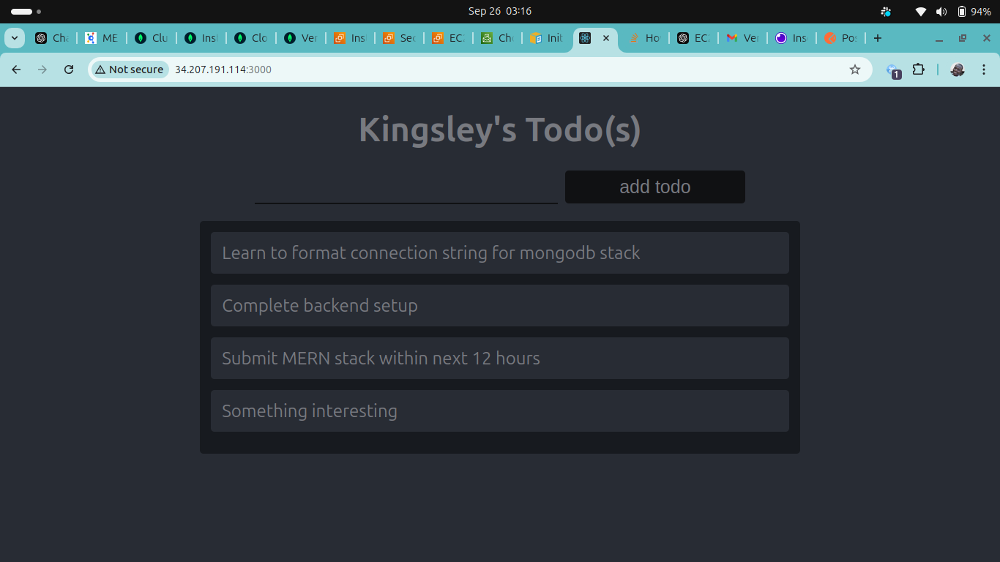

# Learning Journey in Building a MERN Stack Project

A **database** is a collection of information organized for easy access, management, and updating. Databases can be classified into several types, such as bibliographic, full-text, numeric, and image databases.

## Two Major Types of Databases:
1. **Relational Databases (SQL)**: 
2. **Non-relational Databases (NoSQL)**

- **SQL databases** are table-based, while **NoSQL databases** are document-based, key-value stores, graph databases, or wide-column stores.
- SQL databases represent data in the form of tables with rows of data. On the other hand, NoSQL databases consist of collections of key-value pairs, documents, or graphs, with no strict schema definitions.

### Differences:
- **SQL databases** have a predefined schema, while **NoSQL databases** offer dynamic schema for unstructured data.
  
#### Examples:
- SQL: MySQL, Oracle, SQLite, PostgreSQL, MS-SQL
- NoSQL: MongoDB, DynamoDB, Redis, Cassandra, Neo4j, CouchDB

## Database Concepts Refreshed:
- **Indexing**: Improves the speed of data retrieval.
- **Partitioning**: Divides a database into smaller parts for improved manageability and performance.
- **Sharding**: A form of partitioning that distributes data across multiple servers for better performance.

### CAP Theorem:
- It is impossible for a distributed system to provide all three guarantees:
  1. **Consistency**: All nodes see the same data simultaneously.
  2. **Availability**: Every request receives a response.
  3. **Partition Tolerance**: The system continues to operate despite network partitions.

### ACID Properties in Transactions:
1. **Atomicity**: Ensures all operations within a transaction are completed. If one fails, the entire transaction is rolled back.
2. **Consistency**: Guarantees the database remains in a valid state before and after the transaction.
3. **Isolation**: Concurrent transactions don’t affect each other’s outcomes.
4. **Durability**: Ensures changes made by a committed transaction persist, even in case of system failure.

## REST API Design Principles Refreshed:
1. Use **nouns** in endpoint URLs.
2. Use **plural nouns** for consistency.
3. Use **sub-resources** for relationships.
4. Use **query parameters** for filtering, sorting, and searching.
5. Use **HTTP methods** for CRUD operations.
6. Use **status codes** to indicate success or failure.
7. Provide **pagination** for large datasets.
8. Handle errors gracefully and provide meaningful error messages.
9. **Version your APIs** to ensure backward compatibility.
10. Use **authentication and authorization** mechanisms.

### Six REST API Design Principles:
1. **Client-Server Architecture**: The client and server should evolve independently.
2. **Statelessness**: Each request should contain all the necessary information, as the server does not store client state.
3. **Cacheability**: Responses should be marked as cacheable or non-cacheable.
4. **Layered System**: Design the API in layers, where each layer has a specific role.
5. **Uniform Interface**: Ensure consistent use of HTTP methods, status codes, and media types.
6. **Code on Demand (Optional)**: The server can send executable code to the client to extend its functionality.

---

## Backend Development (Node.js, Express, MongoDB)

### EC2 Server Configuration:
- Updated and upgraded `apt` packages.
- Installed Node.js and npm.
- Installed `dotenv` to manage environment variables.
- Configured `index.js` with an Express instance to listen on port 5000 (or the port defined in `.env`).
- Set response headers to allow cross-origin requests.
- Configured EC2 to allow communication on port 5000.
- Retrieved and logged instance metadata and public IP to verify the Express instance is running.

### Setting Up Routes for CRUD Operations:
- Created a `routes` folder to handle all routes for the Todo application.
- In `api.js`, defined routes for creating, viewing, and deleting tasks using HTTP methods (`GET`, `POST`, `DELETE`).
- Imported the router into `index.js` and used it as middleware.

### Setting Up MongoDB:
- Installed the `mongoose` library for MongoDB connection.
- Created a `models` folder to store the schema for the application.
- Defined the Todo schema in `todo.js`.
- Setup MongoDB in the cloud using **mLab DBaaS**.
- Updated environment variables to store the MongoDB connection string in `.env`.

  
### Testing with Postman:
- Tested creating tasks via `POST` requests with a JSON body.
- Tested retrieving tasks via `GET` requests.
- Tested deleting tasks by sending `DELETE` requests with a task ID.

---

## Frontend Development (React)

### React Setup:
- Created a `client` folder for the frontend code.
- Initialized a React app using `create-react-app`.
- Updated `App.js` to display a form for adding tasks.
- Created `Input`, `Todo`, and `ListTodo` components to manage form input, tasks, and task listings.

### Axios for API Requests:
- Used the `axios` library to make HTTP requests from the frontend to the backend.
- Updated `ListTodo` to fetch tasks from the backend API.
- Added functionality in the `Todo` component to handle form submission and add tasks to the backend.

---

## Additional Learnings:
- Learned to use `%d` in Vim command mode to delete entire file content.
- Gained insight into the importance of error handling using `try-catch` blocks in Node.js.
- Explored the `concurrently` package to run multiple npm scripts simultaneously.
- Learned about the significance of using keys in React lists for optimal performance.
- Understood the role of the `proxy` key in `package.json` for API path abstraction.
