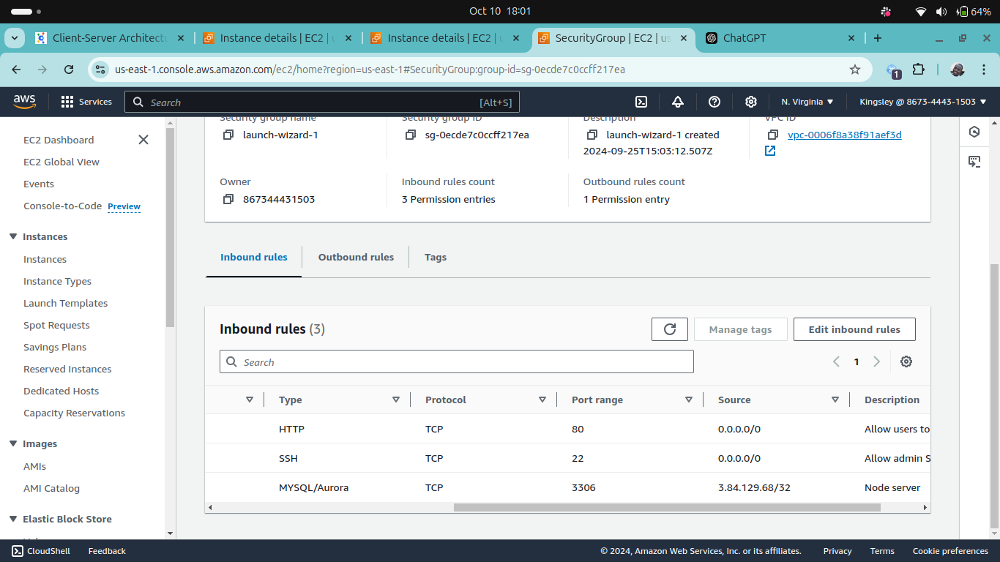
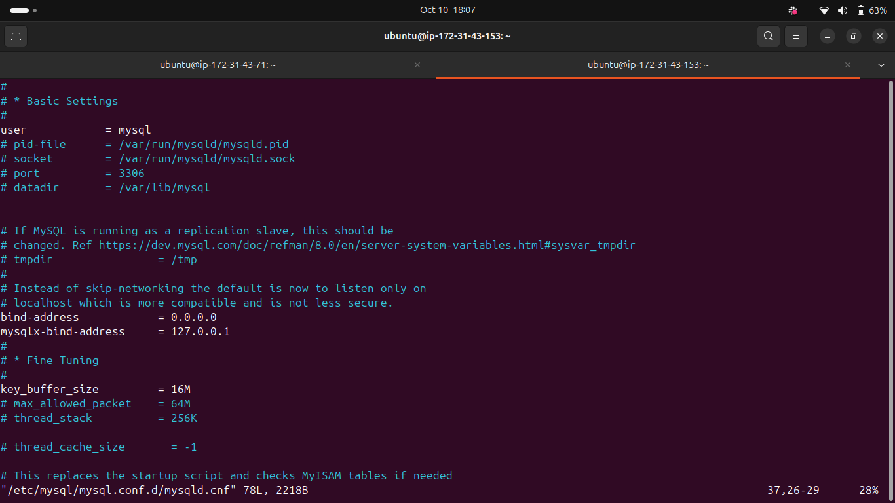
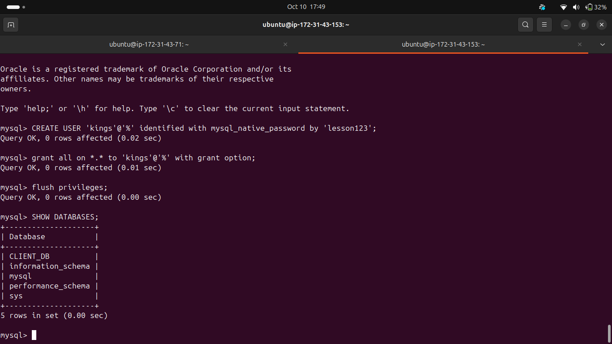
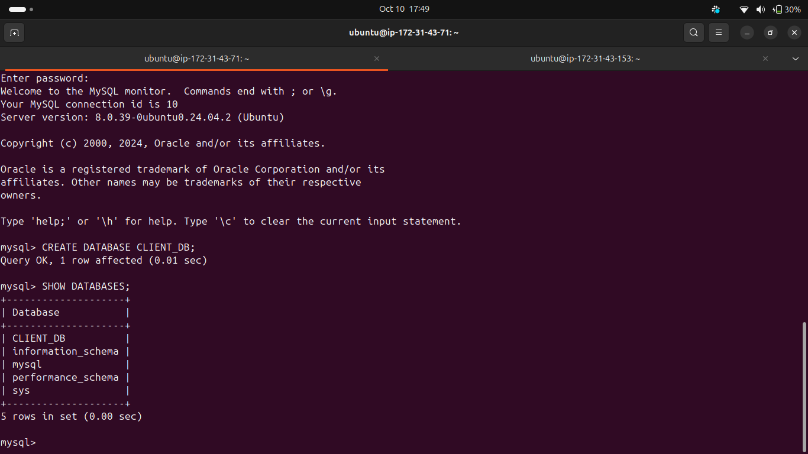

# Learnings from Setting Up MySQL Server and Client on Separate VMs

## Self-Study

### What is Client-Server Architecture?
In a **client-server architecture**, the client and server are distinct entities that communicate over a network. The **client** requests resources or services, and the **server** responds with the requested data or services. This architecture enables resource sharing, centralized management, and scalability, making it fundamental for web applications, database systems, and network communication.

For this project, the **MySQL server** hosted the database, and the **MySQL client** accessed the server to perform database operations remotely.

### The Role of `ping` and `traceroute`
- **Ping**: The `ping` command is used to test network connectivity between two machines. It sends a small packet of data to the destination IP address and waits for a response. It's an essential tool to ensure that the MySQL client can reach the server over the network.
  
- **Traceroute**: `Traceroute` helps to trace the network path from the client to the server, showing each network hop. It’s useful for identifying where communication issues may occur in the network. If ping doesn’t succeed, traceroute can help identify the breakage.

### Basic SQL Statements
- **SELECT**: Retrieves data from one or more tables.
  ```sql
  SELECT * FROM users;
  ```

- **INSERT**: Adds a new record to a table.
  ```sql
  INSERT INTO users (name, email) VALUES ('John Doe', 'john@example.com');
  ```

- **UPDATE**: Modifies existing data in a table.
  ```sql
  UPDATE users SET email = 'john.doe@example.com' WHERE name = 'John Doe';
  ```

- **DELETE**: Removes data from a table.
  ```sql
  DELETE FROM users WHERE name = 'John Doe';
  ```

## Steps I Took

### 1. Setting Up EC2 Instances
I started two EC2 instances named:
- **MySQL Server**
- **MySQL Client**

On the server's **security group (SG)**, I opened:
- **Port 3306**: To allow MySQL traffic, but limited to only the client’s IP address.
- **Port 22**: For SSH access.



### 2. Installing MySQL Server
On the **MySQL Server** instance, I installed the MySQL server:
```bash
sudo apt update
sudo apt install mysql-server
```

### 3. Configuring MySQL for Remote Access
To allow the client to connect remotely, I edited the MySQL configuration to listen on all interfaces by changing the bind address from localhost `127.0.0.1` to `0.0.0.0` in `/etc/mysql/mysql.conf.d/mysqld.cnf`:
```bash
bind-address = 0.0.0.0
```
I restarted the MySQL service to apply the changes.



### 4. Securing MySQL Installation
I ran the MySQL secure installation to improve security by:
- Setting a root password.
- Removing anonymous users.
- Disabling root remote login.

### 5. Creating a Remote User
In the MySQL shell, I created a user with privileges for remote access:
```sql
CREATE USER 'remote_user'@'%' IDENTIFIED BY 'password';
GRANT ALL PRIVILEGES ON *.* TO 'remote_user'@'%';
FLUSH PRIVILEGES;
```



### 6. Installing MySQL Client on the Second VM
On the **MySQL Client** instance, I installed the MySQL client:
```bash
sudo apt install mysql-client
```

Then I connected to the MySQL server using the server’s IP address and the credentials I created:
```bash
mysql -u remote_user -p -h <server_ip>
```



### 7. Enhancing Security
To add more security, I configured UFW (Uncomplicated Firewall):
- First, I allowed SSH and MySQL ports:
  ```bash
  sudo ufw allow 22/tcp
  sudo ufw allow 3306/tcp
  ```
- Then, I enabled UFW to block all other incoming traffic:
  ```bash
  sudo ufw enable
  ```

With UFW enabled, only SSH and MySQL traffic were permitted.

## Conclusion
This project helped me understand how to set up MySQL in a client-server architecture and secure it properly with firewall configurations and user permissions.