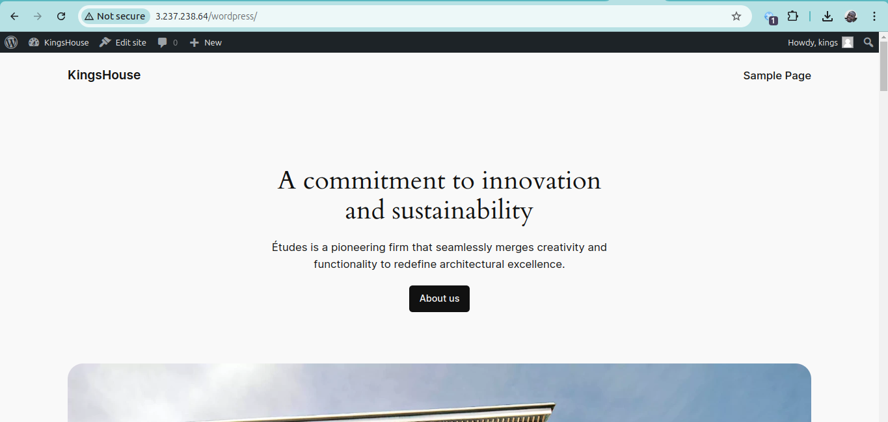

# WordPress Deployment on AWS

This project involves deploying a WordPress website using AWS infrastructure. The deployment includes two EC2 instances: one configured as the web server and the other as the database server. It leverages Red Hat EC2 instances, Logical Volume Manager (LVM) for efficient storage management, Apache as the web server, and MySQL as the database engine. AWS Elastic Block Store (EBS) volumes were also used for persistent storage.

## Table of Contents
- [Project Overview](#project-overview)
- [Technologies Used](#technologies-used)
- [Infrastructure Setup](#infrastructure-setup)
- [Web Server Configuration](#web-server-configuration)
- [Database Server Configuration](#database-server-configuration)
- [WordPress Installation](#wordpress-installation)
- [Learnings](#learnings)
- [Self-Study Takeaways](#self-study-takeaways)

## Project Overview
This project demonstrates how to deploy a fully functional WordPress website by creating a two-tier architecture on AWS, separating the web server and database server. The deployment focuses on:
- EC2 instances (Red Hat)
- LVM-based storage management
- Apache for hosting the WordPress application
- MySQL for database management
- EBS volumes for persistent storage

## Technologies Used
- **AWS EC2**: Elastic Compute Cloud for server hosting
- **AWS EBS**: Elastic Block Store for persistent data storage
- **Red Hat Enterprise Linux**: Operating system for EC2 instances
- **Apache (httpd)**: Web server for hosting the WordPress application
- **MySQL**: Database engine for WordPress
- **LVM**: Logical Volume Manager for efficient storage management

## Infrastructure Setup
1. **Created two Red Hat EC2 instances**: One for the web server and the other for the database server.
2. **Attached three EBS volumes (10GB each)** to each instance to manage storage.
3. **Set up LVM**: Logical Volume Management was implemented for flexible disk management.

## Web Server Configuration
1. **Partitioned and Configured Volumes**:
    - Used `gdisk` to create partitions on the EBS volumes.
    - Set up LVM with `pvcreate`, `vgcreate`, and `lvcreate` to manage the volumes.
2. **Logical Volumes Created**:
    - Logical volumes were created for the application data and log files using `lvcreate`.
    - Filesystems were created with `mkfs.ext4`.
3. **Mounting**:
    - Mounted logical volumes for application and log directories.
    - Updated `/etc/fstab` for persistence on reboot.

## Database Server Configuration
1. **Similar LVM setup**:
    - Created physical volumes, volume groups, and logical volumes.
    - Logical volumes created for database data and logs.
    - Mounted database volumes to `/db/` and `/var/log/mysql/`.
2. **Database Setup**:
    - Installed and configured MySQL.
    - Database and user setup for WordPress.

## WordPress Installation
1. **Installed WordPress**: Downloaded and installed WordPress on the web server.
2. **Configured Apache**: Copied WordPress files to `/var/www/html/`.
3. **Database Connection**: Configured `wp-config.php` with database credentials.
4. **Permissions**: Set appropriate permissions for WordPress files.
5. **Access**: WordPress was successfully accessed through the web server's public IP.

## Learnings
During this project, I gained experience with the following tools and concepts:
- **LVM** (Logical Volume Manager): Managing storage flexibly with `pvcreate`, `vgcreate`, and `lvcreate`.
- **Filesystem**: Understanding `ext4` and its advantages in Linux environments.
- **AWS EC2 & EBS**: Managing cloud infrastructure and storage.
- **Web Server Setup**: Configuring Apache to host dynamic web content.
- **MySQL Database Management**: Setting up MySQL for production environments.

## Self-Study Takeaways

### Three-Tier Architecture
A three-tier architecture separates the application into three distinct layers:
1. **Presentation Layer**: The user interface (in this case, WordPress).
2. **Application Layer**: The logic and operations handled by the web server (Apache).
3. **Data Layer**: The database where all data is stored and retrieved (MySQL).

This architecture ensures scalability, security, and modularity in web application deployments.

### ext4 Filesystem
- **ext4**: The fourth extended filesystem is a robust, high-performance Linux filesystem. It is widely used due to its support for large files and partitions, fast file system checks, and enhanced reliability through journaling.

---

### Author
**Chime Kingsley**  
*Software Engineer | Cloud & DevOps Enthusiast*
