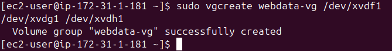

# Cloud/DevOps Engineering - WordPress Web Solution

## Table of Contents
1. [Web Server Configuration](#web-server-configuration)
2. [DB Server Configuration](#db-server-configuration)
3. [WordPress Installation](#wordpress-installation)
4. [Learnings](#learnings)
5. [Self-Study Takeaways](#self-study-takeaways)

---

## Step 1: Web Server Configuration
1. **Created a Red Hat EC2 Instance**: Deployed a Red Hat Enterprise Linux EC2 instance on AWS to serve as the web server.
2. **Attached 3 EBS Volumes**: Added three Elastic Block Storage (EBS) volumes of 10 GiB each to the instance for dedicated storage, ensuring the instance and volumes were in the same region and availability zone for smooth communication.
   
   - Each EBS volume was individually attached to provide storage flexibility, which would later be combined using LVM.
3. **Partitioned the Volumes Using `gdisk`**: Created a single partition of type `Linux Filesystem` for each volume (10 GiB per partition) using the `gdisk` utility.
   
   - This step prepares the raw disks for use by the Logical Volume Manager (LVM).
4. **Installed LVM2**: Installed the LVM2 package, which provides the necessary tools to manage logical volumes.
   - **`pvcreate`**: Initialized the three attached volumes as physical volumes (PVs) to be used by LVM.
     
     
     - This step converts raw disk space into LVM-manageable PVs.
5. **Created a Volume Group**: Grouped the physical volumes into a single volume group called `webdata-vg` using `vgcreate`. This volume group consolidates the storage into a larger pool for logical volume creation.
   
   
6. **Created Logical Volumes**: Used `lvcreate` to create two logical volumes: one for application data (`apps-lv`) and one for logs (`logs-lv`), ensuring a clean separation of application and log data.
   
   - This logical separation improves performance and ease of management.
7. **Created EXT4 Filesystems**: Used `mkfs.ext4` to format the logical volumes with the EXT4 filesystem. EXT4 was chosen for its stability and performance on large volumes.
   
8. **Created Directories for Data and Logs**: Created directories to store application files (`/var/www/html/`) and log files (`/home/recovery/log/`). 
9. **Backed Up and Restored Logs**: Used `rsync` to back up existing logs from `/var/log/` to the new logical volume (`/dev/webdata-vg/logs-lv`) and restored them after mounting.
   
10. **Mounted Logical Volumes**: Mounted the logical volumes for application data and log data on `/var/www/html/` and `/var/log/`, respectively.
11. **Updated `/etc/fstab` for Persistent Mounts**: Added entries for the logical volumes in `/etc/fstab` using their block IDs to ensure they mount automatically on reboot.
   
12. **Tested Persistent Mounting**: Used `sudo mount -a` to test the configuration and `sudo systemctl daemon-reload` to apply changes.

---

## Step 2: DB Server Configuration
The DB server followed a similar configuration process to the web server but with specific modifications for database use:

1. **Created Volume Group for DB Storage**: Named the volume group `dbdata-vg` to manage storage for database data.
2. **Created Logical Volumes for Database and Logs**: Used `lvcreate` to create logical volumes for database data (`data-lv` with 20G) and logs (`dblog-lv` with 8G), which were separately mounted on `/db/` and `/var/log/mysql/`.
3. **Formatted Volumes as EXT4**: Formatted the logical volumes using the EXT4 filesystem for reliability and performance.
   
4. **Mounted the Logical Volumes**: Mounted the logical volumes, following the same procedure as for the web server.
   
5. **Updated `/etc/fstab` for Persistent Mounts**: Updated the fstab configuration to ensure the DB volumes mount on system boot.

---

## Step 3: WordPress Installation
1. **Installed Apache and MySQL**: Installed `httpd` (Apache) and MySQL server on the web server to serve WordPress and manage the database, respectively.
2. **Enabled Services**: Started and enabled the Apache and MySQL services using `systemctl enable --now` to ensure they start automatically on reboot.
3. **Installed WordPress**: Downloaded and configured WordPress on the web server, adjusting the `wp-config.php` file to connect to the MySQL database.
4. **Transferred Files**: Moved WordPress files to `/var/www/html/` to be served by Apache.
5. **Set Ownership and Permissions**: Used `chown -R apache:apache /var/www/html/wordpress` to set ownership to the Apache user for proper access.
6. **Configured MySQL Database**: Created a MySQL user and granted appropriate privileges for WordPress to interact with the database.
7. **Opened Security Group Ports**: Adjusted AWS security groups:
   - Opened port 3306 on the DB server to allow traffic from the web server.
   - Opened port 80 on the web server to allow HTTP traffic from the internet.
8. **Accessed WordPress**: Verified the installation by accessing WordPress using the public IP of the web server.
   

---

## Learnings
### Mastered Command-Line Tools
- **rsync**: A fast and reliable tool for syncing files locally and remotely, useful for backups and mirroring.
- **lvm**: Provides flexibility in managing storage by allowing resizing, creating, and removing logical volumes.
- **pvcreate**: Prepares physical disks for use in LVM by marking them as physical volumes.
- **vgcreate**: Groups multiple physical volumes into a single volume group, making management easier.
- **lvcreate**: Allocates space from a volume group to create logical volumes for applications or data.
- **mkfs**: Builds a new filesystem on a partition or logical volume, preparing it for data storage.
- **mount**: Attaches filesystems to a directory structure so they can be accessed by the operating system.
- **lsblk**: Provides detailed information about block devices and their relationships (e.g., disks, partitions, and LVM).
- **gdisk**: A GPT partitioning tool that allows creating, editing, and deleting partitions.
- **vgs**: Displays information about volume groups in LVM.
- **lvs**: Lists all logical volumes and provides detailed information about their status and usage.
- **vgdisplay**: Shows detailed attributes of volume groups, such as size and available space.

### Conceptual Knowledge
- **Logical Volume Management (LVM)**: LVM abstracts physical storage, enabling easier resizing and management of disk space.
- **Filesystem**: A method of organizing and storing data, with EXT4 being a robust, journaling filesystem ideal for large-scale data storage.
- **Block Device**: A device that reads or writes data in fixed-size blocks (e.g., hard drives), used by LVM to manage data.

---

## Self-Study Takeaways
### Three-Tier Architecture
Three-tier architecture is a widely adopted model for designing web applications. It divides the system into three distinct layers:

1. **Presentation Layer**: Responsible for the user interface, typically a web browser or mobile app. In this project, users interact with WordPress through their browsers.
2. **Application Layer**: Handles business logic, processes user inputs, and communicates between the presentation and data layers. WordPress itself, running on the web server, acts as the application layer.
3. **Data Layer**: Manages the application's data and ensures its storage and retrieval. MySQL, hosted on the DB server, provides the database for storing WordPress content and user data.

This architecture allows separation of concerns, facilitating scalability, maintainability, and security. Each layer can be developed, scaled, and maintained independently.

### EXT4 Filesystem
The EXT4 (Fourth Extended Filesystem) is a journaling filesystem widely used in Linux environments. Key features of EXT4 include:

- **Journaling**: Keeps track of changes in a journal before they are applied to the filesystem, protecting against data corruption in case of crashes or power loss.
- **Performance**: Efficiently handles large volumes of data, making it suitable for high-performance applications such as database servers.
- **Backward Compatibility**: EXT4 can mount EXT3 and EXT2 files

## Fun spots
1. Tried to connect to the DB server from the web server without configuring WordPress.

- **Fix:** Updated credentials in webserver php config

