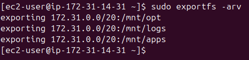

# Web Server Setup with NFS, LVM, MySQL, and WordPress on AWS


## Table of Contents
1. [Introduction](#introduction)
2. [Step 1: Red Hat EC2 Instance Setup](#step-1-red-hat-ec2-instance-setup)
3. [Step 2: Client Server Setup](#step-2-client-server-setup)
4. [Step 3: Automating Server Setup with User Script](#step-3-automating-server-setup-with-user-script)
5. [Final Steps](#final-steps)
6. [Self Study Takeaways](#self-study-takeaways)
   - [NAS](#nas)
   - [SAN](#san)
   - [Block Storage](#block-storage)
   - [Object Storage](#object-storage)
   - [NFS](#nfs)
7. [Fun Spot](#fun-spot)

---

## Introduction
This project documents the process of setting up a web server using AWS services like EC2 and EBS, NFS for shared storage, and MySQL for database management. The goal was to configure a scalable infrastructure that could host a WordPress site while using efficient storage management with LVM. The documentation is structured to walk through the setup step-by-step and includes a self-study section for additional learning.

---

## Step 1: Red Hat EC2 Instance Setup
1. **Spun up a Red Hat EC2 instance** on AWS.
2. **Created and attached three EBS volumes** (each 10GB) to the EC2 instance.
3. **Logged into the server** and partitioned the attached volumes using `gdisk`.
4. **Installed `lvm2`** to enable LVM management and created a volume group and logical volumes using the following commands:
    - `vgcreate` for volume groups.
    - `lvcreate` for logical volumes.
5. **Formatted the logical volumes** with `mkfs.xfs` and mounted them to `/mnt`.
6. **Added entries to `/etc/fstab`** for persistent mounting using their `blkid UUID`.

7. **Installed `nfs-utils`** and configured NFS by editing `/etc/exports` to share directories across instances:
   ```bash
   /mnt/apps my_server_subnet_cidr_block(rw,sync,no_root_squash)
   /mnt/logs my_server_subnet_cidr_block(rw,sync,no_root_squash)
   /mnt/opt my_server_subnet_cidr_block(rw,sync,no_root_squash)
   ```

8. **Verified the NFS exports** using:
   ```bash
   sudo exportfs -v
   ```

   

9. **Checked RPC services** with:
   ```bash
   rpcinfo -p
   ```
   This helped determine the correct NFS ports to open for traffic.

   

10. **Opened necessary ports** in the security group to allow NFS traffic.
11. **Installed MySQL**, created a database and user using `mysql_secure_installation`.

   

---

## Step 2: Client Server Setup
1. **Launched a new EC2 instance** and installed `nfs-utils` to enable NFS functionality.
2. **Mounted the shared directories** from the NFS server using `mount -t nfs` and verified with `df -h`.
3. **Persisted the NFS mounts** by adding entries to `/etc/fstab`.
4. **Installed `httpd`** (Apache) and tested connectivity by creating a test file in `/var/www/html` and accessing it from the NFS server.

---

## Step 3: Automating Server Setup with User Script
To streamline the configuration process, I created a user script to automate the setup on multiple instances. This script performs the following tasks:

- Install necessary packages (`nfs-utils`, `httpd`, `php`).
- Mount the NFS shares.
- Update `/etc/fstab` to ensure mounts persist.
- Configure and start Apache and PHP services.

```bash
#!/bin/bash

# Install NFS utilities and create mount points
sudo yum install nfs-utils nfs4-acl-tools -y
sudo mkdir -p /var/www var/logs /mnt/opt

# Mount NFS shared directories
sudo mount -t nfs -o rw,nosuid my_host_server_private_ip:/mnt/apps /var/www
sudo mount -t nfs -o rw,nosuid my_host_server_private_ip:/mnt/logs /var/logs
sudo mount -t nfs -o rw,nosuid my_host_server_private_ip:/mnt/opt /mnt/opt

# Add entries to /etc/fstab
echo "my_host_server_private_ip:/mnt/apps /var/www nfs defaults 0 0" | sudo tee -a /etc/fstab
echo "my_host_server_private_ip:/mnt/logs /var/logs nfs defaults 0 0" | sudo tee -a /etc/fstab
echo "my_host_server_private_ip:/mnt/opt /mnt/opt nfs defaults 0 0" | sudo tee -a /etc/fstab

# Reload systemd and mount the filesystems
sudo systemctl daemon-reload
sudo mount -a

# Install Apache and PHP
sudo yum install httpd -y
sudo dnf install php php-opcache php-gd php-curl php-mysqlnd -y

sudo systemctl start httpd
sudo systemctl enable httpd
```


---

## Final Steps
- **Cloned the tooling project** from `StegHub/tooling`.
- **Populated the database** using `tooling-db.sql`.

   

- **Created a MySQL admin user** with full privileges on the database.
- **Moved the HTML files** to `/var/www/html` and configured Apache permissions.
- **Updated database connection details** in the tooling code and tested connectivity.

   

- **Verified database communication** from the server’s localhost and its public IP.
- **Tested connectivity** from other servers to ensure NFS and MySQL are functioning as expected.

---

## Self Study Takeaways

### NAS
NAS (Network Attached Storage) provides file-level storage that allows multiple users and clients to share files over a network. It uses IP protocols, making it easy to scale for small to medium-sized businesses.

### SAN
SAN (Storage Area Network) offers block-level storage, providing raw disk access. It’s typically used in enterprise environments for high-performance applications like databases.

### Block Storage
Block storage breaks down data into blocks, which are managed independently. It’s highly flexible for databases and transactional applications, and AWS EBS is a common example.

### Object Storage
Object storage manages data as objects, storing them with metadata and a unique identifier. It’s ideal for unstructured data like multimedia files. AWS S3 and Azure Blob Storage are examples.

### NFS
NFS (Network File System) allows multiple clients to access shared directories over a network. It’s useful for environments where file sharing is necessary between multiple servers.

---

## Fun Spot

During the final setup, I encountered an unexpected issue where I couldn’t access my site from a browser for over an hour. After troubleshooting, I realized the problem was due to my VPN. Once I turned it off, everything worked perfectly!

**Debugging Tip:** Use the `ss` command to view active connections and listening ports, which can help you identify network issues. It’s a lifesaver when things aren't going as expected!

Remember, every challenge is a learning experience. Don’t hesitate to try even simple fixes like disabling your VPN—it could save you hours!

---

That's my experience setting up a scalable and efficient web infrastructure on AWS. Stay tuned for more insights and improvements!


---
