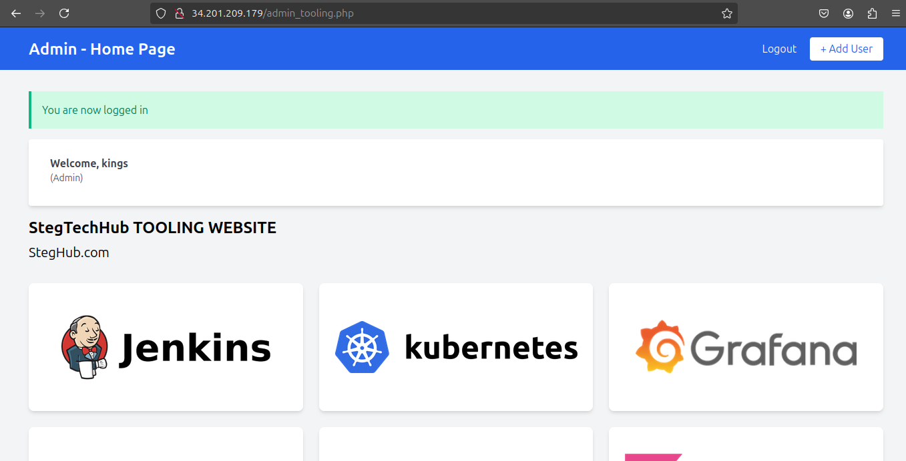

# Building a Robust Load Balancing Solution with Apache

## Table of Contents
1. [Introduction](#introduction)
2. [Self-Study Takeaways](#self-study-takeaways)
   - [Key Concepts](#key-concepts)
   - [Types of Load Balancing](#types-of-load-balancing)
   - [Load Balancing Algorithms](#load-balancing-algorithms)
3. [Implementation Steps](#implementation-steps)
   - [NFS Server Configuration](#nfs-server-configuration)
   - [Web Server Configuration](#web-server-configuration)
   - [Database Server Configuration](#database-server-configuration)
   - [Load Balancer Configuration](#load-balancer-configuration)

## Introduction
In this project, I explored the intricacies of load balancing using Apache. Through diligent self-study and hands-on implementation, I learned to configure a load-balanced environment that enhances performance and reliability for web applications.

## Self-Study Takeaways

### Key Concepts
1. **DNS Server**: Translates domain names into IP addresses, acting as the internet's phone book.
2. **DNS Record/Zone File**: Contains information about a domain name, including IP addresses and name servers.
3. **Round Robin DNS**: Distributes incoming traffic across multiple servers to improve performance and reliability.
4. **Load Balancing**: Distributes network traffic among multiple servers to enhance efficiency and reliability.
5. **L4 Network Load Balancer**: Distributes traffic based on IP address and port number.
6. **L7 Application Load Balancer**: Distributes traffic based on application-layer information, such as URLs and HTTP headers.
7. **Types of Load Balancing**:
   - **Static Load Balancing**: Uses predefined rules to distribute traffic.
   - **Dynamic Load Balancing**: Adapts to the current load on servers to optimize resource usage.

### Types of Load Balancing
#### Static and Dynamic Load Balancing
- **Dynamic Load Balancing**: 
   - **Least Connections**: Directs traffic to the server with the fewest active connections.
   - **Least Response Time**: Routes traffic to the server with the shortest response time.
   - **Weighted Round Robin**: Allocates traffic based on assigned server weights.

- **Static Load Balancing**:
   - **Round Robin**: Distributes requests in a circular manner.
   - **IP Hash**: Allocates traffic based on client IP address hash.
   - **URL Hash**: Distributes based on URL hash.

### Load Balancing Algorithms
1. **By Traffic**: Allocates based on the volume of traffic each server can handle.
2. **By Requests**: Distributes based on the number of requests each server can manage.
3. **By Busyness**: Allocates traffic according to the current workload of the servers.
4. 

### Load Balancer Factor
The **lb factor** parameter indicates the weight of each server, helping to determine how many requests each can handle effectively.

## Implementation Steps
- 
### NFS Server Configuration
1. Set up a **RHEL 9 EC2** instance on AWS as the NFS server.
2. Created and attached three **10GB EBS volumes**.
3. Partitioned volumes with `gdisk` and installed `lvm2` for logical volume management.
4. Configured NFS exports to share directories across instances.
5. Started and enabled the NFS server.

### Web Server Configuration
1. Deployed two **RHEL 9 EC2** instances as web servers.
2. Installed Apache and set up NFS mounts for application directories.
3. Installed necessary PHP packages for dynamic content handling.

### Database Server Configuration
1. Set up an **Ubuntu 24.04 EC2** instance as the database server.
2. Installed MySQL and created a database for the tooling project.
3. Configured the MySQL service for remote access.

### Load Balancer Configuration
1. Configured a **Ubuntu 24.04 EC2** instance as the load balancer.
2. Installed Apache and set up DNS resolution for load balancing across web servers.
- 

3. Tested the setup for proper traffic distribution.
- 
