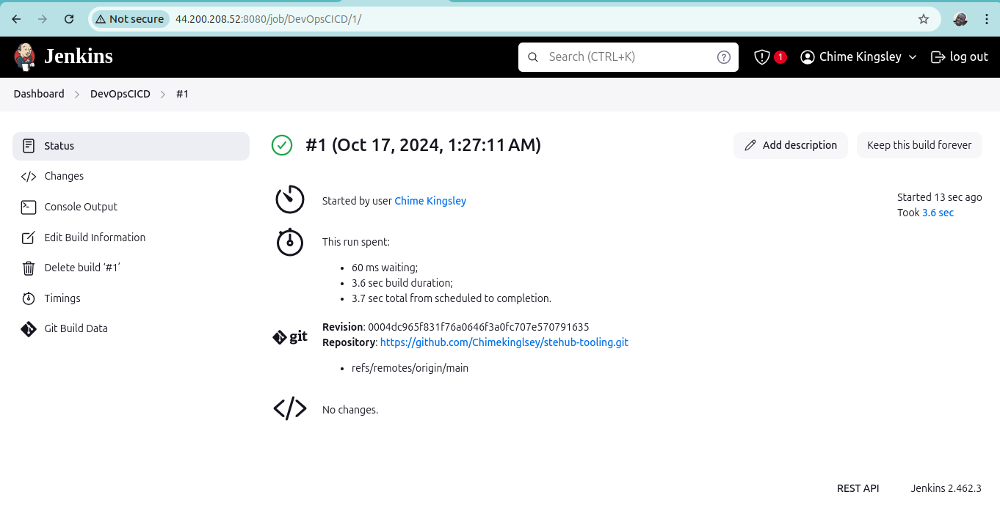
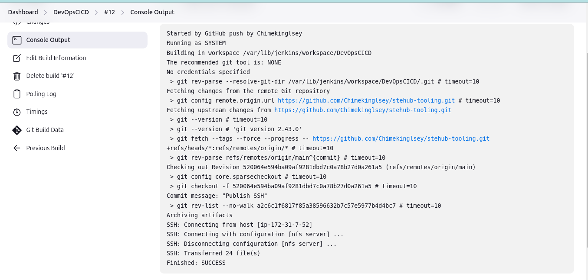

# Project Learnings: CI/CD with Jenkins

## Table of Contents
1. [Self Study](#self-study-jenkins-cicd-pipeline)
2. [Project Steps](#project-steps)
3. [Blockers and Solutions](#blockers-and-solutions)

## Self Study: Jenkins CI/CD Pipeline

**Continuous Integration (CI)** is a software development practice that enhances code deployment speed and quality. Developers frequently commit code changes—often several times daily—which triggers automated builds and tests. This process ensures that new code integrates smoothly with the existing codebase. If issues arise, CI platforms prevent merging and alert the team for quick resolution.

CI aligns with Agile methodologies, promoting flexibility and rapid feedback. This approach allows teams to detect and address issues early, adapting swiftly to changing requirements.

### Benefits of CI:
- **Increased productivity and efficiency**
- **Faster time-to-market**
- **Higher product quality and stability**
- **Enhanced customer satisfaction**

CI achieves these outcomes by facilitating early conflict resolution and allowing for rapid identification of issues. Frequent commits mean less code to review at once, enabling faster builds and tests.

### How CI Works:
1. **Commit**: Developers push code to a shared repository.
2. **Build**: CI systems automatically build the application.
3. **Test**: Automated tests assess code functionality and quality.
4. **Inform**: CI provides rapid feedback on build success or failure.
5. **Integrate**: Successful changes are merged into the main branch.
6. **Deploy**: CI often integrates with Continuous Delivery (CD) for automated deployment.

### Best Practices:
- Integrate testing into the development process (e.g., Test-Driven Development).
- Ensure testing environments mirror production.
- Set up effective monitoring and alerts.
- Automate deployment workflows.

Adopting CI enhances software delivery, fosters collaboration, and allows teams to respond effectively to change.

## Project Steps

1. **Launched Ubuntu 24.04 LTS EC2 Instance**  
   Set up an EC2 instance on AWS to serve as the Jenkins server.

2. **Installed Jenkins on Ubuntu 24.04 LTS EC2 Instance**  
   Successfully installed Jenkins, enabling powerful automation capabilities for CI/CD.  
   

3. **Set Up Webhooks on GitHub Tooling Repo**  
   Configured webhooks that point to the Jenkins server URL, allowing automated triggers on code changes.  
   

4. **Created a Jenkins Job**  
   Developed a Jenkins job that triggers on pushes to the GitHub tooling repository.  
   

5. **Successfully Built the Job**  
   Executed the Jenkins job and confirmed a successful build.  
   

6. **Configured Jenkins Job for Main Branch**  
   Adjusted the Jenkins job to run on the main branch and build on push, including post-build actions.  
   

7. **Installed `Publish Over SSH` Plugin**  
   Added the `Publish Over SSH` plugin to Jenkins for copying files to a remote NFS server.  
   

8. **Configured a RHEL 9 NFS Server**  
   Set up an NFS server with EBS volumes in the same subnet as the Jenkins server, ensuring the necessary security group rules were in place.

## Blockers and Solutions

1. **Jenkins Job Not Triggering on Push**  
   - **Solution**: Added a trailing slash to the GitHub webhook URL in the repository settings to ensure proper triggering.

2. **Damaged Root Binaries on NFS Server**  
   - **Issue**: Used `chmod -R` incorrectly while granting permissions to the Jenkins user.  
   - **Solution**: Relaunched the NFS server and reconfigured the Jenkins job to copy files correctly.

3. **Cached Old Configurations in Jenkins Job**  
   - **Issue**: Jenkins attempted to copy files to the old NFS server despite saving new configurations.  
   - **Solution**: Deleted the post-build configurations and reconfigured the Jenkins job to point to the new NFS server.

---

This project has enhanced my understanding of CI/CD practices, Jenkins configurations, and the intricacies of working with AWS services. I'm looking forward to applying these learnings in future projects!
