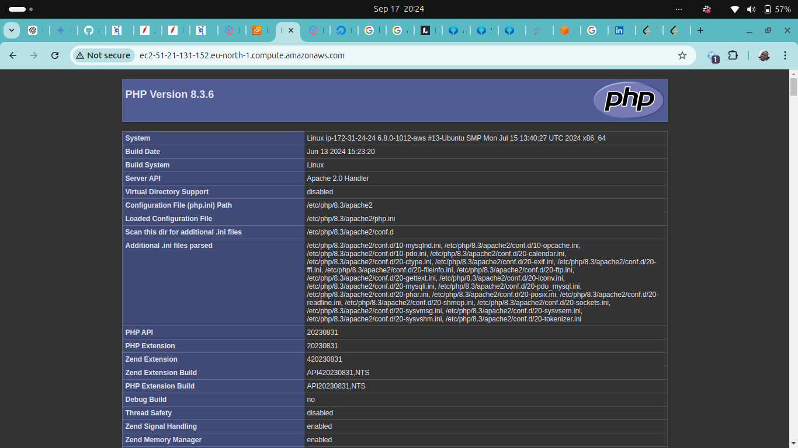
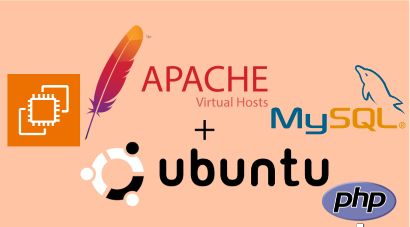

# LAMP Stack Deployment on AWS EC2


This DevOps project demonstrates the successful deployment of a **LAMP** stack (Linux, Apache, MySQL, PHP) on an AWS EC2 instance. The project utilizes Ubuntu 24 as the base operating system, Apache as the web server, MySQL as the database management system, and PHP as the server-side scripting language. Additionally, it includes the configuration of Apache virtual hosts to enable hosting multiple websites on the same server.

## Skills Acquired

- Scripting
- Foundations of DevOps
- Cloud Infrastructure Management
- Web Server Configuration
- Database Setup and Security

## Learning Objectives

- [x] Set up the AWS Console for cloud resource management
- [x] Launch an EC2 instance on AWS and connect via SSH
- [x] Understand web server technology stacks
- [x] Install Apache, MySQL, and PHP on an EC2 instance
- [x] Configure Apache to use virtual hosts for multiple websites

## Project Steps

### 1. Environment Setup

- Configured development environment in Visual Studio Code
- Created an AWS account and set up the AWS Management Console
- Launched an EC2 instance and connected via SSH

### 2. Installing Apache and Updating Firewall

Installed Apache web server and configured the firewall to allow HTTP and HTTPS traffic.

```bash
sudo apt update
sudo apt install apache2
sudo ufw allow in "Apache Full"
```


### 3. Installing MySQL

Installed MySQL and secured the installation:

```bash
sudo apt install mysql-server
sudo mysql_secure_installation
```

### 4. Installing PHP

Installed PHP and necessary modules:

```bash
sudo apt install php libapache2-mod-php php-mysql
```

### 5. Configuring Apache Virtual Hosts

Created a new virtual host for `projectlamp`:

```bash
sudo mkdir /var/www/projectlamp
sudo chown -R $USER: /var/www/projectlamp
sudo vim /etc/apache2/sites-available/projectlamp.conf
```

Virtual host configuration:

```apache
<VirtualHost *:80>
    ServerName projectlamp
    ServerAlias www.projectlamp
    ServerAdmin webmaster@localhost
    DocumentRoot /var/www/projectlamp
    ErrorLog ${APACHE_LOG_DIR}/error.log
    CustomLog ${APACHE_LOG_DIR}/access.log combined
</VirtualHost>
```


Enable the new site and disable the default site:

```bash
sudo a2ensite projectlamp
sudo a2dissite 000-default
sudo systemctl reload apache2
```

### 6. Testing PHP with Apache

Created a PHP info page:

```bash
sudo echo '<?php phpinfo(); ?>' > /var/www/projectlamp/index.php
```

## LAMP Stack Components

| Component | Description | Status |
|-----------|-------------|--------|
| Linux     | Ubuntu 24 on AWS EC2 | ✅ |
| Apache    | Web Server | ✅ |
| MySQL     | Database Management System | ✅ |
| PHP       | Server-side Scripting | ✅ |


## Conclusion

This project successfully deployed a fully functional LAMP stack on an AWS EC2 instance. Key accomplishments include:

- Setting up a cloud environment on AWS
- Installing and configuring Linux, Apache, MySQL, and PHP
- Configuring Apache virtual hosts for multiple websites

The hands-on experience gained from this project reinforces understanding of cloud computing, server administration, and DevOps fundamentals. The skills acquired in scripting, system administration, and cloud infrastructure management are crucial for the DevOps field and provide a solid foundation for more advanced projects and deployments.

## Future Enhancements

- Implement SSL/TLS for secure connections
- Set up a CI/CD pipeline for automated deployments
- Explore containerization of the LAMP stack using Docker

## Contributing

Contributions to improve this project are welcome. Please fork the repository and submit a pull request with your changes.
